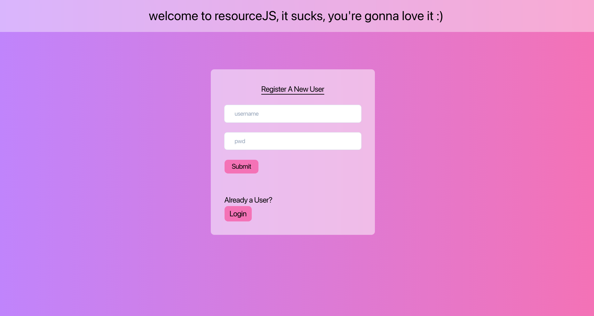
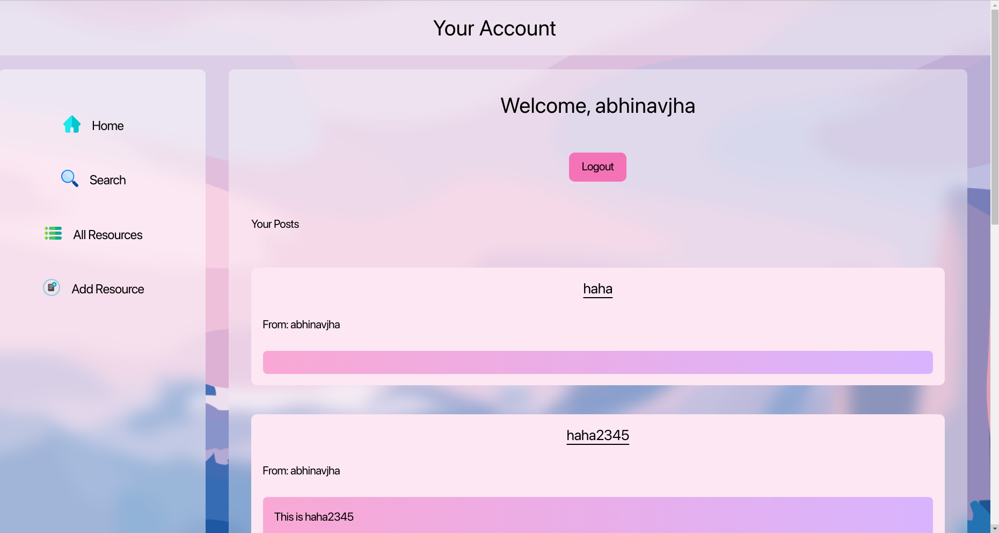
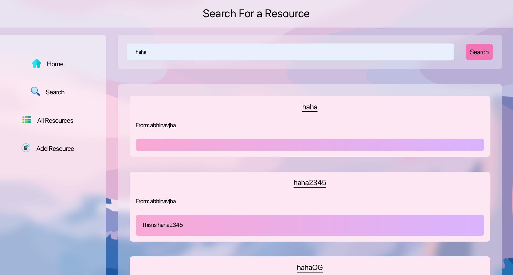
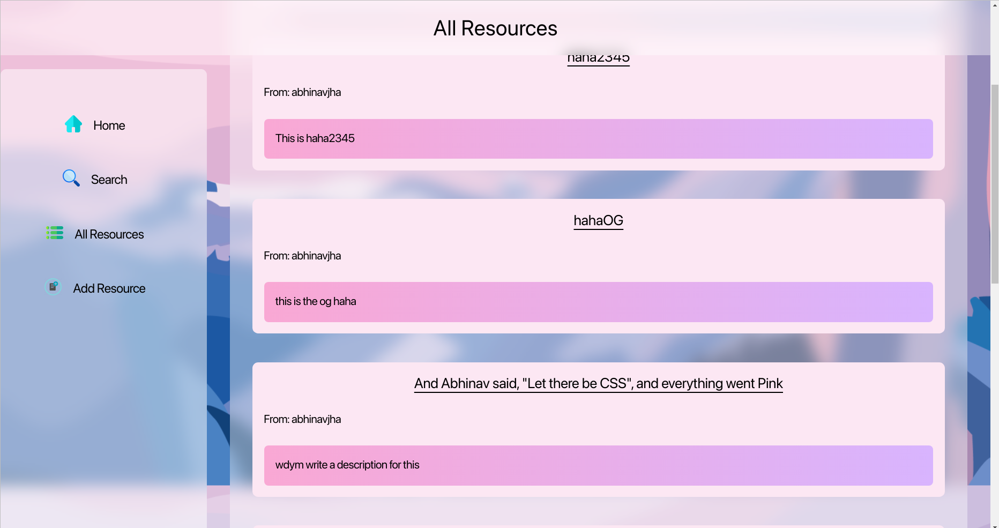
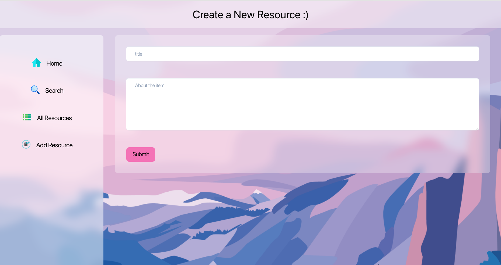
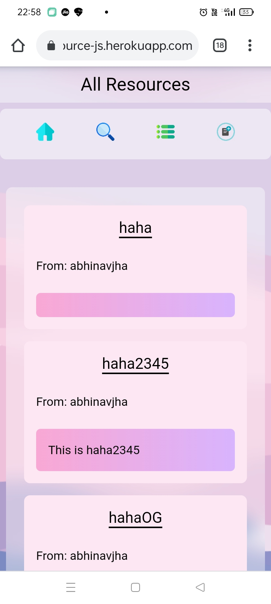

# ResourceJS

## Introduction

Wanted a place where you can hop on and quickly search for a particular kind of resource shared by other people near you? Books, Bikes, Pen Drives, whatever it is that you want to find and/or share, ResourceJS is the perfect place!

## Source Code Description 

ResourceJS utilizes the following technologies:
  - HTML/CSS/JS for the front end
  - Node.js + Express + MongoDB (Atlas) for the back end
  - EJS as the view engine
  - Mongoose as the ODM
  - JWT tokens for user authentication
  - TailwindCSS for, well, the CSS (along with some custom CSS)
  - Bcrypt for password hashing

## You can find the deployed app [here](https://resource-js.herokuapp.com/)
## You can find the overview video [here](./vid/resourceJSvid.mkv)
## Installation

### Prerequisites:
```
git node (and npm which comes with node)
```

To install:

  1. Clone this repository with: 

```
git clone git@github.com:abhinav-0401/Debugit_2022.git
```
  2. Open the Debugit_2022 directory in your terminal of choice

  3. Install npm dependencies: 
```
Debugit_2022> npm install 
```
  4. Note: TailwindCSS is a devDependency, and thus isn't ***required if you only want to view/run the project as it is.*** By default, running `npm install` in the project directory will also install tailwind. Add the `--production` flag to avoid installing it:
```
Debugit_2022> npm install --production
```
  5. Now, to run the server, use:
  ```
  Debugit_2022> node app.js
  ```

  6. Open your web browser and navigate to `localhost:8888/`. You should see the following on your first run:
   
   
   
   
   
   Responsive design
   

   7. Note: Clicking on the `Your Posts` text on the Home page toggles your posts, meaning it either hides or shows posts made by your account.
## Source Code Run-through
  
### A quick glance at the project structure will show the 4 most important folders in this project:
  1. `views`
  This is the folder where all the actual *views*  are stored. These are `ejs` files that the server uses to generate HTML files, which you then see.
  2. `models`
  These are models that map to the MongoDB database. There are two models corresponding to the two types of data stored in the DB:
  - Users
  - Resources

  3. `routes`
  These are `router` files that do the heavy lifting here, answering API calls, GET/POST requests. 
  4. `static-src`
  Static client side CSS, JS and image files

### As well as the following files in the `root`: 
  1. `app.js` : This file is where the server starts, and mongoose connects to the DB, plus the routers are used here.

  2. `package.json` : Dependencies for the projects are listed here

  3. `tailwind.config.js` : Configuration file for `Tailwind`

# About Me and Contact Information

Hey, I am **Abhinav Jha**. I'm a fresher at IIT BHU, from the Mining Department. My interests lie in many fields, but cracking annoying jokes is probably the most visible of them :)

## You can email me at:

 - linuxlenin04@gmail.com (personal mail, ask 12 year old me why i decided to use this name)
 - abhinav.jha.min21@itbhu.ac.in (institute mail)

## Instagram handle: 
  ### abhinav_0401

