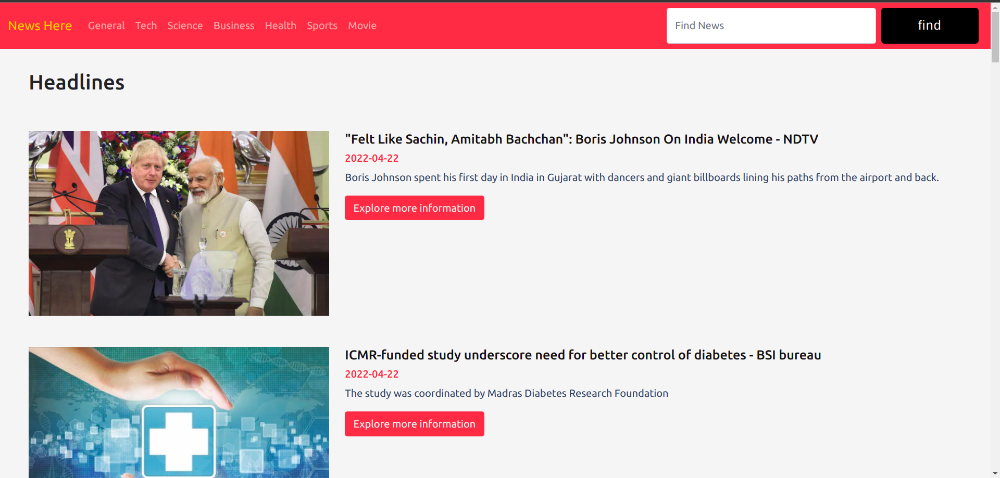
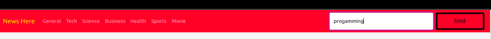
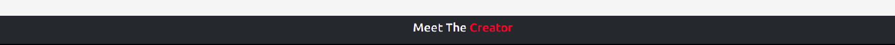
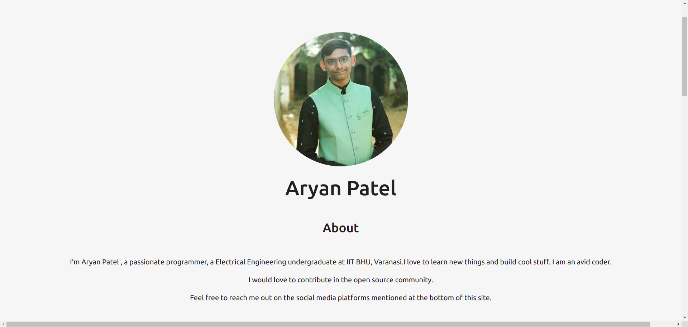

## Debugit 2022

## Introduction

Each individual want a good news website to stay up-to-date what is going on around the globe. So,i have made a News website for you to get all the HEADLINES at one click.

## how to start the website

- Clone my git [repository](https://github.com/Eli4479/Debugit_2022)
  in your local system.
- open Index.HTMl on any web server you have access to.
- thats it!!

## Technology Used

HTML to render on website
css with Bootstrap for making the website look lit
Javascript to functionality of the website to grab the required and latest version of news Using API

## Who to surf in the website

1:

on load you get all the recent headlines of the news but if you don't want the headlines you can click on the navbar button to see news of the specific domain like general,business,tech etc.

2:

if your domain is not on the navbar don't worry about it you can search for your domain in the search place on the navbar.

## Contact ME

3:

on the news site you can scroll to the bottom there you can see footer saying "Meet The Creator"
click on it you will go to my portfolio website

## Portfolio website

3:

It is my second website. It is the page where you can find about me find what is have done,my past education status visit my old project and contact me on different social networks.

## video demonstration
